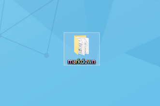
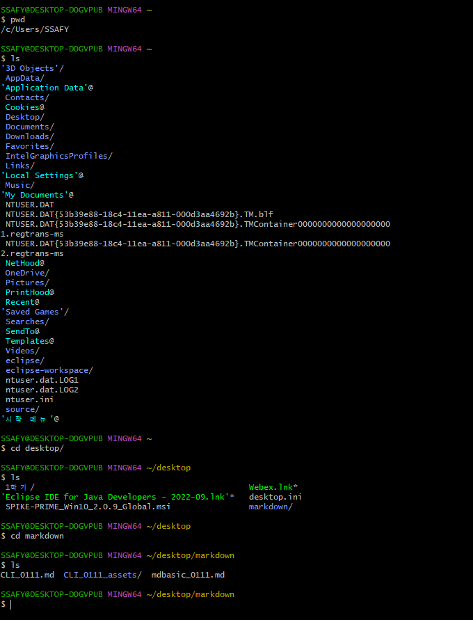

# CLI

#### 개념

- **C**ommad **L**ine **I**nterface

- 명령어를 통해 사용자와 컴퓨터가 상호작용하는 방식
* **GUI** (**G**raphic **U**ser **I**nterface): 그래픽을 통해 사용자와 컴퓨터가 상호작용하는 방식

---

> 바탕화면에 있는 markdown폴더를 연다.

- GUI: 현재 열어둔 모든 창을 내리고 바탕화면에서 폴더를 더블클릭한다.
  
  
  
  - 사용하기 쉽지만 단계가 많고, **컴퓨터의 성능을 많이 소모한다.**
  
  

- CLI: Command창에서 경로를 desktop/markdown으로 설정한다.
  
  
  
  - 많은 서버/개발 시스템이 CLI를 통한 조작환경을 제공한다.

---

#### CLI 명령어

- `touch`
  
  - 파일 생성

- `mkdir` (Make directory)
  
  - 새 폴더 생성

- `ls` (list)
  
  - 현재 작업중인 디렉토리의 폴더/파일 목록 보여줌

- `pwd`
  
  - 현재 경로 확인

- `cd 폴더명` (change directory)
  
  - 현재 작업중인 디렉토리 변경
  
  - `..` : 상위 폴더

- `start, open`
  
  - 폴더/파일을 염 (Window는 start, Mac은 open)

- `rm`
  
  - 파일 삭제
  
  - `-r` : 폴더 삭제

- `mv 파일 폴더명`
  
  - 파일을 다른 폴더로 옮기기

- `mv 파일 바꿀파일이름`
  
  - 파일명 변경

---

#### 경로

- root directory(메인 폴더) : Users/SSAFY 폴더
  
  - 바탕화면은 사용자 편의를 위해 존재하는 폴더일 뿐, 메인 폴더가 아니다.

- 절대경로
  
  - (root directory부터) C://User/SSAFY/desktop/markdown  → 마크다운의 절대경로

- 상대경로
  
  - (지금 내 위치부터) ~/markdown  → 마크다운의 상대위치
  
  - (마크다운에서)../../ → SSAFY의 상대위치
